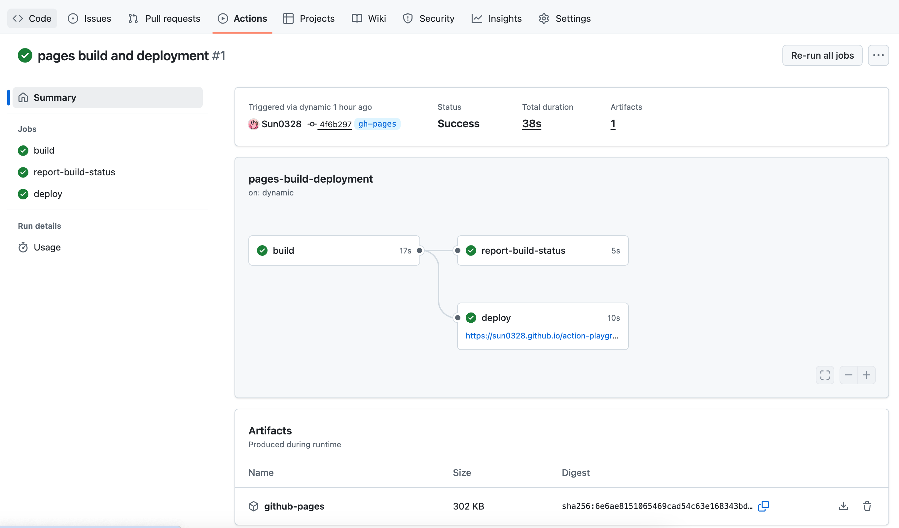
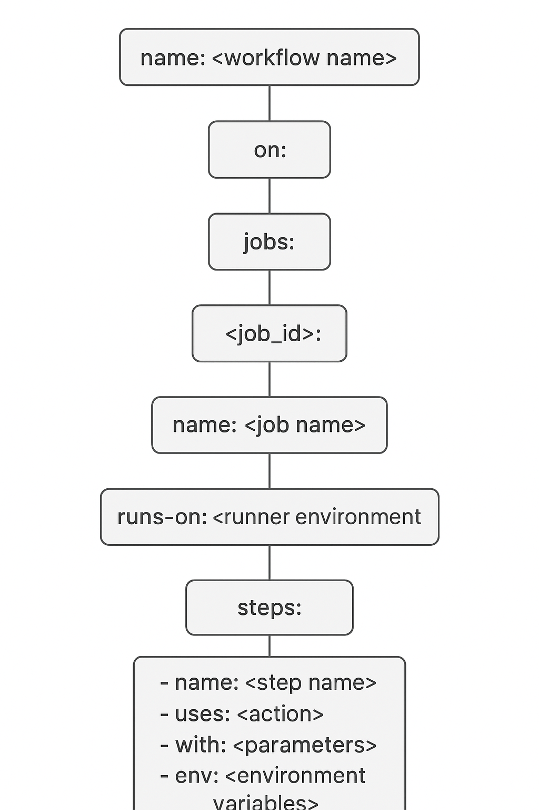

# Github Actions with React App

The static page was deployed with github-pages-deploy-action@v4 [Page](https://github.com/Sun0328/action-playground/deployments/github-pages).

Action name: pages build and deployment


# Actions Workflow


Core concept of Actions: Define automatic jobs after specific action (e.g. push, merge)

## Workflow Name

**`name: CI/CD with Docker & GitHub Pages`**  
- This is the name of the workflow in the GitHub Actions.

---

## Trigger

**`on: push`**  
- The workflow is triggered every time you push code to the repository.  
- You can also trigger workflows on `pull_request`, `schedule`, or other events.

---

## Steps
#### 1. Checkout Code
```yaml
- name: Checkout code
  uses: actions/checkout@v4
```
Uses the official checkout action to pull your repository code into the runner.
This is required for all subsequent steps.
#### 2. Install Dependencies & Build
```yaml
- name: Install dependencies & build
  run: |
    npm install
    npm run build
```
Runs shell commands to:
Install project dependencies (npm install)
Build the project (npm run build), generating a build folder with static files.
#### 3. Deploy to GitHub Pages
```yaml
- name: Deploy to Github Pages
  uses: JamesIves/github-pages-deploy-action@v4
  with:
    branch: gh-pages
    folder: build
```
Uses the github-pages-deploy-action to deploy the built files to GitHub Pages.
branch: gh-pages → The branch where the site is published.
folder: build → The folder containing the generated static files.

# Docker CI/CD Workflow: Build & Push Image

This GitHub Actions workflow automatically builds a Docker image from your repository and pushes it to Docker Hub whenever you push code.

---

## Workflow Name

**`name: Build the image and push it to Docker Hub`**  
- This is the workflow title displayed in the GitHub Actions UI.

---

## Trigger

**`on: push`**  
- The workflow is triggered on every push to the repository.  
- You can also trigger it on `pull_request`, `schedule`, or other events.

---

## Jobs

### `npm-build`

```yaml
npm-build:
  name: npm build
  runs-on: ubuntu-latest
```
Job ID: npm-build (used internally).
Display Name: npm build.
Runner: ubuntu-latest (GitHub's latest Ubuntu VM).

### Steps
#### 1. Login to Docker Hub
```yaml
- name: Login to Docker Hub
  uses: docker/login-action@v3
  with:
    username: ${{ secrets.DOCKER_HUB_USERNAME }}
    password: ${{ secrets.DOCKER_HUB_TOKEN }}
```
Secrets:（repo/Setting/Secrets and variables/Actions/Repository secrets）
DOCKER_HUB_USERNAME → Your Docker Hub username
DOCKER_HUB_TOKEN → Your Docker Hub access token
Authentication is required before pushing images.
Docker hub -> setting -> Personal access token

#### 2. Build Image and Push to Docker Hub
```yaml
- name: Build image and push to Docker Hub
  uses: docker/build-push-action@v5
  with:
    push: true
    tags: ${{ secrets.DOCKER_HUB_USERNAME }}/action-playground:latest
```
Uses Docker's build-push action to:
Build the Docker image from your repository.
Push it to Docker Hub (push: true).

Tags:
The image is tagged as username/action-playground:latest using your Docker Hub username from secrets.